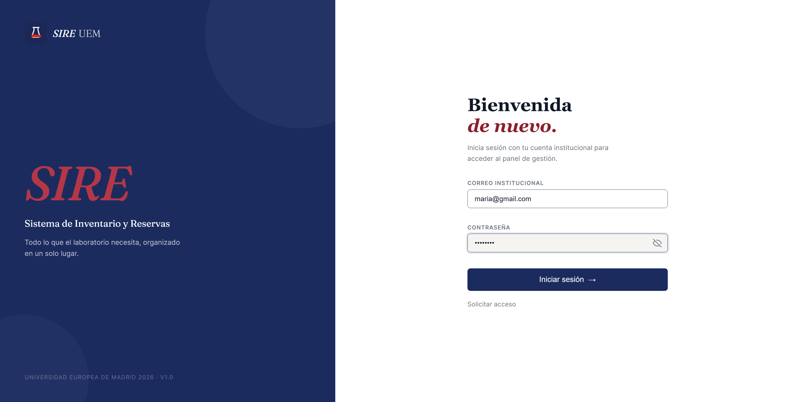

<div align="center">

# SIRE - University Lab Management System

**Full-stack web platform for the centralized management of university laboratories.**

*Solo-developed end-to-end - Final Degree Project - Universidad Europea de Madrid*


</div>

---

## Table of Contents

- [Overview](#overview)
- [Screenshots](#screenshots)
- [The Problem](#the-problem)
- [The Solution](#the-solution)
- [Tech Stack](#tech-stack)
- [Architecture](#architecture)
- [Key Features](#key-features)
- [User Roles and Permissions](#user-roles-and-permissions)
- [Security](#security)
- [Development Journey](#development-journey)
- [My Role](#my-role)
- [Outcome and Recognition](#outcome-and-recognition)
- [Why the Code Isn't Public](#why-the-code-isnt-public)
- [Contact](#contact)

---

## Overview

**SIRE** (*Sistema de Inventario y Reservas*) is a full-stack web application designed and developed for the laboratories of Universidad Europea de Madrid. It replaces the fragmented, manual workflow previously based on spreadsheets, emails and paper forms with a single integrated platform that centralizes inventory, equipment, reservations, purchasing, and technical staff coordination.

The project was built end-to-end by a single developer over five months as a Final Degree Project (TFG), from initial stakeholder interviews with university lab staff to a production-ready deployment configuration. Following the defense, the university expressed interest in its future deployment, with the corresponding proposal and legal documentation currently in preparation.

<div align="center">

| Metric | Value |
|:------:|:-----:|
| REST API endpoints | **~50** |
| Angular components | **60+** |
| Database entities | **26** |
| User roles | **8** |
| Fine-grained permissions | **18** |
| Development timeline | **5 months** |

</div>

---

## Screenshots

> All personal data shown is fictitious (seed data).

<div align="center">

### Login



---

### Purchasing Manager dashboard


---

### Stock alerts


---

### Stock movement history


---

### Equipment QR code


---

### Equipment QR label


---

### Reservations calendar


---

### Room reservation form


---

### Reservation detail with capacity check


---

### Bulk reservation upload


---

### Bulk upload conflict handling


---

### New purchase request


---

### Purchase request management


</div>

> Screenshots live in `./screenshots/`.

---

## The Problem

Before SIRE, Universidad Europea de Madrid managed its engineering laboratories through a mix of:

- Multiple spreadsheets across different departments, often out of sync.
- Email chains for lab reservations, with no central visibility.
- Paper forms for purchase requests and incident reporting.
- Verbal communication between lab technicians and coordinators.

This created concrete daily problems:

- Stock inconsistencies - materials marked as available were actually missing.
- Double-booked labs - two groups arriving to the same room at the same time.
- No traceability - impossible to know who used what, when, or why.
- Manual, error-prone reporting - end-of-term reports required hours of spreadsheet reconciliation.
- No accountability - incidents (spilled reagents, broken equipment) had no owner.

The Laboratory Coordination team needed a single tool that different profiles (students, teachers, technicians, coordinators, purchasing staff, administration) could use with different levels of access, in real time.

---

## The Solution

SIRE centralizes the full lifecycle of laboratory operations in one integrated web platform:

- Inventory of consumables, materials and reagents.
- Equipment records with QR-based identification.
- Biological materials with lot, expiry and location traceability.
- Room and equipment reservations with real-time capacity control.
- Purchase requests with approval and tracking workflows.
- Technical staff coordination and shift assignment.
- Mass CSV/XLSX data upload with pre-validation.
- Automated low-stock alerts and notifications.
- Full operational audit trail.

The platform is designed as a decoupled client-server architecture, deployable in production with commodity Linux infrastructure, and adaptable to any faculty or lab-based organization with minor domain adjustments.

---

## Tech Stack

<div align="center">

### Backend


### Frontend


### Database


### Infrastructure and DevOps


</div>

**Detailed breakdown:**

| Layer | Technologies |
|-------|--------------|
| **Backend** | Python 3, Django 6.0, Django REST Framework 3.17, `djangorestframework-simplejwt`, Gunicorn |
| **Frontend** | Angular 19, TypeScript, RxJS, reactive forms, guards, HTTP interceptors |
| **Database** | MySQL 8 (containerized with Docker), Django ORM |
| **Infrastructure** | Ubuntu Server, Nginx (reverse proxy and static files), Docker Compose |
| **Security** | JWT tokens, dual-layer permission validation, HTTPS with HSTS, secure cookies, XSS protection, anti-clickjacking |
| **Tooling** | Git, VS Code, Postman (API testing), Figma (UI wireframes) |

---

## Architecture

SIRE follows a decoupled three-tier client-server architecture communicating over HTTP/HTTPS with JSON payloads.

```
                       ┌────────────────────────┐
                       │   User (web browser)   │
                       └────────────┬───────────┘
                                    │ HTTPS
                                    ▼
                       ┌────────────────────────┐
                       │  Nginx (reverse proxy  │
                       │  + static file server) │
                       └────┬───────────────┬───┘
                            │               │
                    /api/*  │               │  /*
                            ▼               ▼
                    ┌──────────────┐  ┌──────────────────┐
                    │   Gunicorn   │  │  Angular 19 SPA  │
                    │    (WSGI)    │  │    (compiled)    │
                    └──────┬───────┘  └──────────────────┘
                           │
                           ▼
              ┌──────────────────────────────┐
              │  Django 6 + DRF              │
              │  - ~50 REST endpoints        │
              │  - JWT authentication        │
              │  - 18-permission role matrix │
              │  - Business validation layer │
              └──────────────┬───────────────┘
                             │ ORM (parameterized SQL)
                             ▼
              ┌──────────────────────────────┐
              │  MySQL 8 (Docker container)  │
              │  - 26 relational entities    │
              │  - Full audit trail          │
              └──────────────────────────────┘
```

**Request flow:**

1. The user accesses SIRE from any modern web browser.
2. Nginx serves the compiled Angular SPA and acts as a reverse proxy for API calls.
3. Angular sends JWT-authenticated REST requests to the backend.
4. Django validates the token, checks the role's permissions against the 18-permission matrix, and executes the business logic.
5. The response returns as JSON to the frontend.
6. Every relevant operation is persisted for traceability and auditing.

---

## Key Features

### Inventory management
- Full CRUD for consumables with categorization.
- Automated low-stock alerts with configurable thresholds per item.
- Movement history (who took what, when, how much).
- Mass upload via CSV / XLSX with pre-validation and error reporting.

### Equipment management
- Detailed equipment records with photos, technical specs and maintenance history.
- QR-based identification for instant access from mobile devices in the lab.
- Availability tracking and reservation integration.

### Biological materials
- Specific control with lot, expiry date and physical location traceability.
- Compliance-oriented workflow for regulated materials.

### Reservations and capacity control
- Visual weekly and monthly calendars.
- Real-time conflict detection - no double bookings.
- Configurable room capacity (people, equipment count) with hard limits.
- Approval workflow where needed.

### Purchase requests
- Full request lifecycle: submission - approval - tracking - reception.
- Integration with inventory (automatic stock update on reception).
- Cost centre and budget tracking.

### User and permission management
- 8 distinct user roles, each with a tailored interface.
- 18 fine-grained permissions distributed across roles.
- Dual-layer permission validation (frontend guards and backend enforcement).

### Notifications and auditing
- Real-time alerts (stock, reservations, approvals) shown in the UI.
- Email notifications via SMTP (password recovery, key events).
- Complete operational audit log - every action is traceable to a user, timestamp and payload.

---

## User Roles and Permissions

The system supports 8 differentiated user profiles, each with its own interface and permission set. All permission checks are enforced twice: once in the frontend (Angular guards) and once in the backend (Django REST Framework permission classes).

| Role | Description |
|------|-------------|
| **Student** | Views their own reservations and requests materials for practical sessions. |
| **Teacher** | Reserves labs and equipment for their classes, requests materials for group activities. |
| **Lab Technician** | Manages inventory, prepares labs, handles day-to-day operations. |
| **Lab Coordinator** | Approves reservations and purchases, oversees lab activity. |
| **Purchasing Manager** | Manages the full purchase-request workflow and supplier relationships. |
| **Researcher** | Uses labs and equipment for research projects, requests biological materials. |
| **Administration** | Manages users, generates reports, oversees the platform. |
| **System Administrator** | Full system access, platform configuration, security auditing. |

---

## Security

Security is enforced at multiple layers:

- JWT authentication with short-lived access tokens and refresh rotation.
- Dual-layer permission validation - never trust the frontend alone.
- SQL injection prevention via strict ORM parameterization (no raw SQL).
- HTTPS-ready with HSTS, secure cookies and anti-clickjacking headers.
- XSS protection through Angular's automatic sanitization and CSP-ready configuration.
- Password recovery through signed one-time SMTP links (no password sent in plaintext).
- Full audit log of every state-changing operation.
- CORS whitelist restricted to the institutional origin in production.

---

## Development Journey

The project was developed over five months following an iterative, user-centred methodology:

1. **Requirements gathering** - Interviews with the Lab Coordination team, lab technicians and administration staff at Universidad Europea de Madrid. Identification of pain points and workflow modelling.
2. **Architecture design** - Data model (26 entities), permission matrix, endpoint contracts, UI wireframes in Figma.
3. **Backend development** - Django models, REST API, JWT authentication, permission classes, business validation.
4. **Frontend development** - Angular SPA, role-adapted interfaces, reactive forms, real-time validation.
5. **Integration and testing** - Manual and functional testing across all user roles, edge case validation.
6. **Deployment preparation** - Dockerization, Nginx and Gunicorn configuration, HTTPS setup, environment-based configuration for production.
7. **Handoff and documentation** - Complete technical documentation, user manuals per role, deployment manual.

Throughout the project, regular check-ins with the Lab Coordination team ensured the tool matched real operational needs rather than a purely academic vision.

---

## My Role

I designed, developed and prepared this project for production entirely on my own as my Final Degree Project. Specifically:

- **Requirements gathering** with real university stakeholders (coordination, lab technicians, administration).
- **Architecture and stack decisions** (three-tier design, JWT strategy, ORM choice, deployment approach).
- **Data modelling** - designed the 26-entity relational schema from scratch.
- **Backend development** - full Django + DRF implementation, ~50 REST endpoints, authentication, permissions, business logic.
- **Frontend development** - Angular 19 SPA with 60+ components, UI/UX design for 8 differentiated user profiles.
- **Security implementation** - JWT, permission matrix, HTTPS configuration, input validation.
- **DevOps and deployment** - Dockerization, Nginx and Gunicorn configuration, Ubuntu Server preparation.
- **Documentation** - technical memoir (~190 pages), user manuals per role, and deployment guide.

The only external contribution was academic supervision from Ing. Jairo García Fernández (thesis director).

---

## Outcome and Recognition

- **Graded 10 / 10 with Distinction (Matrícula de Honor)** - the highest academic recognition in the Spanish university system.
- **Positively received by Universidad Europea de Madrid**, which has expressed interest in its future deployment.
- **Deployment and maintenance proposal in progress** - following the successful defense, the corresponding commercial proposal and legal documentation are currently being prepared. No contract has been signed to date.
- **Full technical memoir** of ~190 pages submitted alongside the platform.
- **Intellectual property registered** with the Regional Intellectual Property Registry of Madrid, with the author as sole titleholder.

---

## Why the Code Isn't Public

This system has been designed and prepared with a real institutional environment in mind. Publishing the source code publicly would expose authentication logic, JWT handling and permission enforcement of a system intended for institutional use, reveal the full REST endpoint structure and data model before any deployment hardening review, undermine the value of the intellectual property currently under registration and negotiation, and conflict with the licensing terms being defined for the potential deployment agreement. This repository therefore serves as a project showcase and technical case study, not a code distribution. Serious enquiries from recruiters, potential clients or collaborators interested in a private walkthrough can reach out via the contact section below.

---

## Contact

**Sahar Amanmohammadi**
*Full-Stack Developer*

- Email: [saharaman09@gmail.com](mailto:saharaman09@gmail.com)
- LinkedIn: [linkedin.com/in/sahar-amanmohammadi](https://www.linkedin.com/in/sahar-amanmohammadi)

---

<div align="center">

**© 2026 Sahar Amanmohammadi.**

</div>
